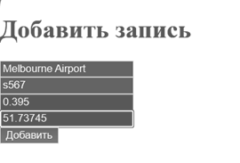

# RSRAPI_Neo4j
Приложение делает REST API запросы (GET, PUT, POST) к нереляционной базе данных Neo4j, в шаблоне добавления узла (Аэропорта со свойствами город) и связей (рейсов), сделанном с Flask веб-сайте.

# Обзор приложения
Приложение представляет собой сайт Flask с подключенной картой от Яндекс и работы с REST API запросами к нереляционной базе данных Neo4j, который учитывает рейсы перелетов самолетов в аэропортах.


Список с рейсами (связей) и аэропортов (узлов) отметки на Яндекс.картах.



Можно добавить новый аэропорт (узел) через интерфейс прямо на карту, указав его координаты и привязанный к нему рейс.


База данных Neo4j на их сайте. Представляет собой своеобразную сеть с узлами и связями между ними. У узлов и связей может быть множество атрибутов, по которым потом их можно фильтровать. Она очень наглядно представляет как связанны данные между собой.

В основном файле также представлен вариант работы с Rest api запросами между командами в панеле Python и базой данных Neo4j.


# Инструкци REST-API сервиса

1. Открыть проект PythonNeo4j

2. Neo4j web сохраняется локально, поэтому в проекте в файле main.py нужно ввести данные к своей базе данных Neo4j, предварительно создав ее.
```
driver = GraphDatabase.driver("neo4j://localhost:7687", auth=("neo4j", "sdvj9w84j9"))
URI = "neo4j://localhost:7687"
AUTH = ("neo4j", "sdvj9w84j9")
```
URI по умолчанию должен быть такой же. При входе на свою бд в neo4j выведется адрес, просто нужно ставить в нужном формате в эти строки.
Логин по умолчанию тоже “neo4j”.
Пароль задается свой.

3. По моему проекту в базу данных отправляются POST, GET и PUT запросы, которые добавляют узлы и связи, изменяют свойство название узла и выводит в консоль узел со всем связями исходящими от него в формате JSON. Если вывести узел от которого не выходят связи, он не выведется.

4. Через пользовательский интерфейс можно выполнить эти запросы.
Рекомендуемая последовательность:
    1) Создать два узла (Аэропортов со свойством имя и город)
    2) Создать связь от одного узла к другому (создается рейс с со свойством имя)
    3) При желании можно изменить название любого аэропорта который есть в вашей бд.
    4) Вывод: вывести аэропорт из которого выходит связь.
Такой вывод должен получиться
```
ведите название аэропорта: Kazan_International_Airport
<Node element_id='4:749e8159-60cf-4618-ad79-e9db767a3ff9:5' labels=frozenset({'Aeroport'}) properties={'AirportName': 'Kazan_International_Airport', 'City': 'Kazan'}> d123 <Node element_id='4:749e8159-60cf-4618-ad79-e9db767a3ff9:4' labels=frozenset({'Aeroport'}) properties={'AirportName': 'Vnukovo', 'City': 'Moscow'}>
```

